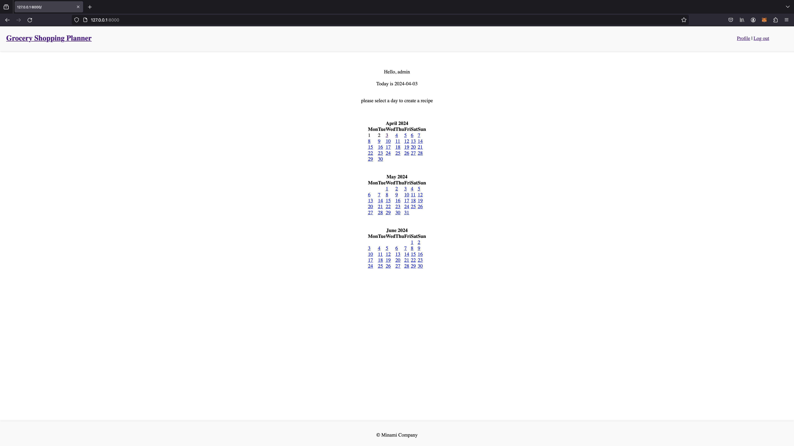
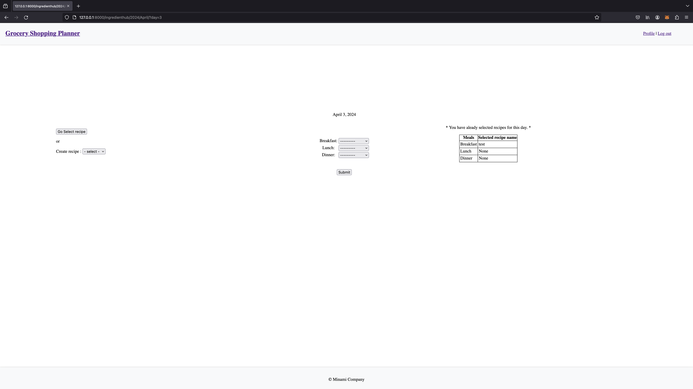
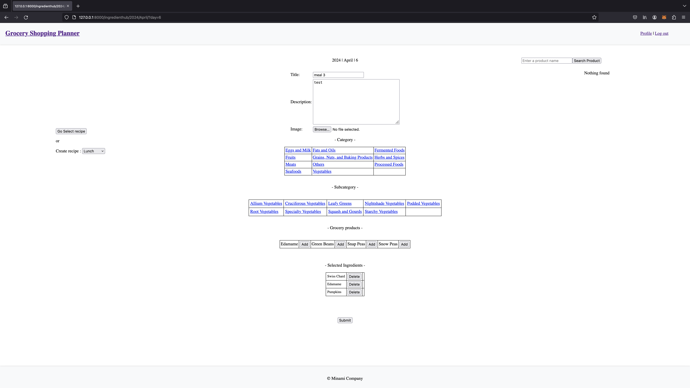
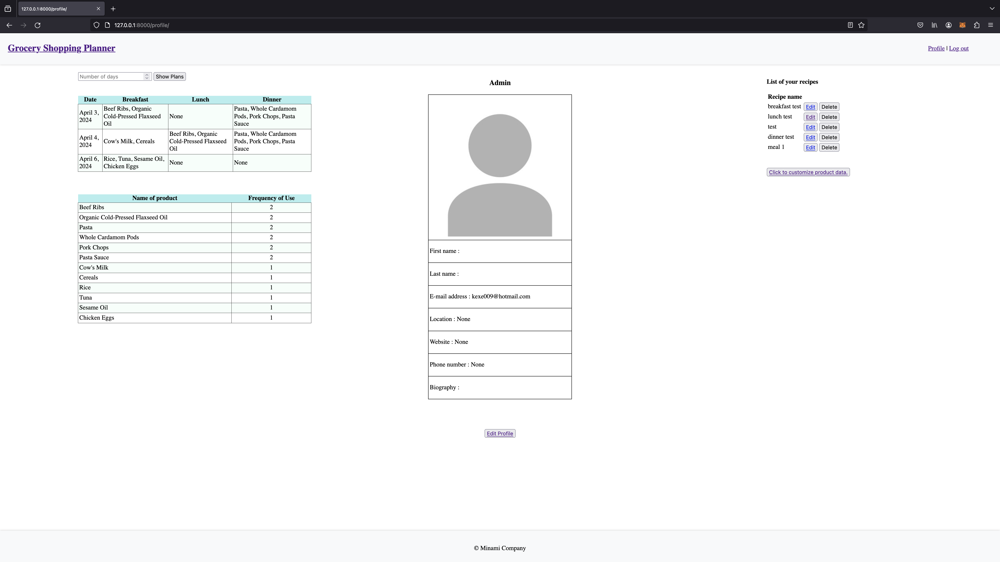
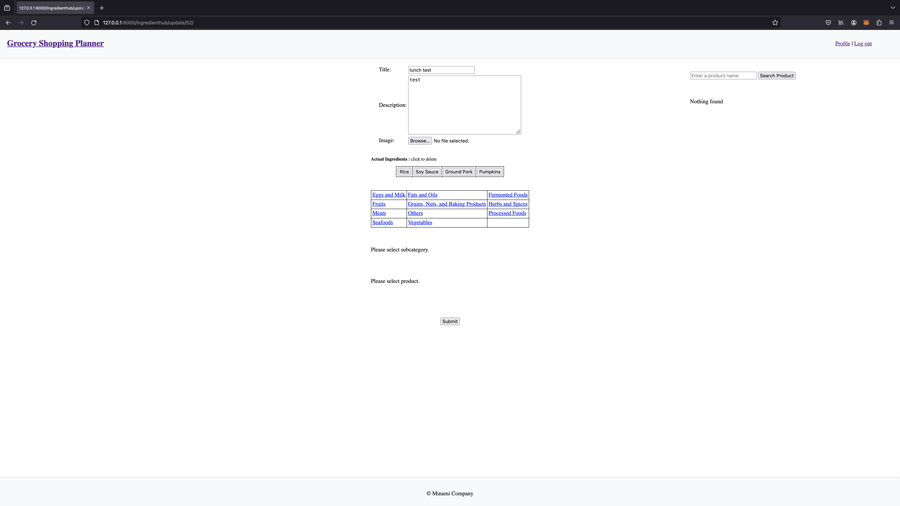
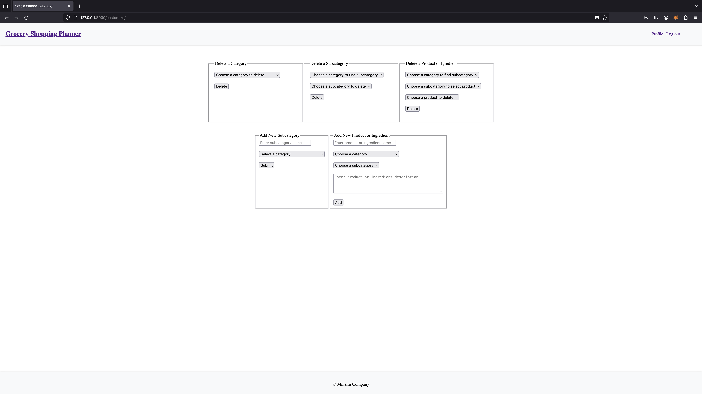

# Grocery Shopping Planner

### Purpose:

 **1. This application is designed for individuals living alone or with a partner, aiming to assist them in creating meal plans. Personally, I often prepare weekly meal plans and have automated this process using Python and Django.**

**2. This is my first application created using Python and Django. Through this project, I aimed to deepen my understanding of both Python and Django. Additionally, I learned HTML and CSS, creating all the pages from scratch without relying on any templates.**

* Users are required to sign up in order to fully utilize all the available features.
* This 'home' page displays calendars for 3 months, allowing users to plan up to a maximum of 3 months in advance.
* Fast days can no longer be selected, and the calendars will automatically update once they have passed.

* Initially, users start with no recipes. However, by selecting options like breakfast, lunch, and dinner, they can create recipes. Once a recipe is created, it can be reused multiple times. This makes the process of creating a meal plan much quicker and more efficient once users have accumulated several recipes.
* On the right side, the table shows if a plan has already been created for the selected day and lists the chosen recipes.

* The data for grocery products are organized by category, subcategory, and individual products. This structure allows users to easily locate a product, even when there's a large amount of data stored
* On the right side of the interface, users have the option to directly search for and find specific products.
* Users can effortlessly remove any product that has been incorrectly selected.

* On the left side of the profile page, users can access their meal plan.
* By default, the plan is shown for a 7-day period. At the top of the left side, users can enter a different number of days to extend the display period of their plan.
* Below on the left side, a table displays the frequency with which ingredients and products will be used over the selected period. Users can use this list as a guide for purchasing groceries.
* On the right side of the profile page, users have the option to edit their own recipes.
* Further down on the right side, users can access to customize ingredients and groceries to suit their dietary needs, such as vegan or vegetarian preferences.

* This page allows users to edit their recipes by easily removing selected ingredients or products and adding new ones.

* This page enables users to customize ingredients and groceries. They can easily remove or add categories, subcategories, and products according to their preferences.